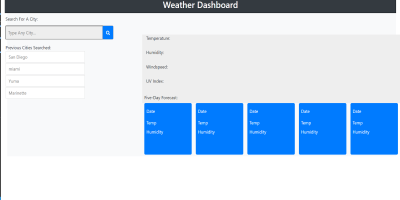

# WeatherDashboard

# Screenshot of App

# DESCRIPTION

Are you interested in what the weather forecast is for your hometown? How about what the weather will be like when you go on vacation tomorrow? Well, this Weather Dashboard app is here to help. You can use this app, type in any city you wish, and it will procure a 5-day weather forecast for your desired city. This app was created using Local Storage, JavaScript, HTML, and CSS.

The URL for this website is: https://sjlevalley.github.io/WeatherDashboard/

## Installation

This website requires no special programs for viewing.

## Usage

This website is interactive and takes user input to function

## Credits

Credit for this website goes to the UCSD-Extention Coding Bootcamp

## License

---

## Badges

None

## Features

There are no special features in this project.

## How to Contribute

N/A

## Tests

N/A
